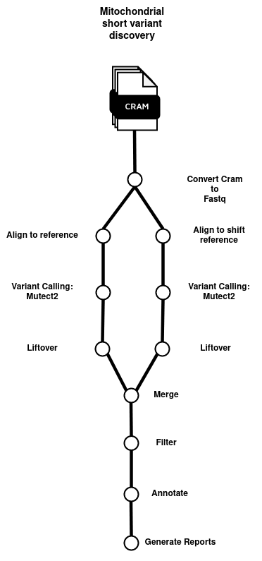

# nextflow_pharmacogenomics
Pipeline for Mitochondrial short variant discovery based on GATK best [practices](https://gatk.broadinstitute.org/hc/en-us/articles/4403870837275-Mitochondrial-short-variant-discovery-SNVs-Indels-) and nf-core pipeline [rarediseases](https://nf-co.re/raredisease/1.1.1).



## Overview
This document describes the usage of a Nextflow workflow designed for running mitochondrial analysis. This workflow is configured to be run with Docker,Singularity containers, ensuring reproducibility across different computing environments.

## Prerequisites
- Nextflow >=23.04.0'
- Singularity

The pipeline uses [Igv-reports](https://github.com/igvteam/igv-reports) to generate reports. Container image is not provided!
## Installation
Clone this repository:
```bash
git clone this repository URL
cd   nextflow_mitochondrial
```

## Running the Workflow
To successfully run the workflow, different input parameters are required:

```bash
nextflow \
run main.nf \
-profile singularity \
--input assets/samplesheet.csv \
--dict /path/to/reference/dictionary/hsapiens.GRCh38.hl.dict \
--fasta /path/to/reference/fasta/hsapiens.GRCh38.hl.fasta \
--fasta_fai /path/to/reference/index/hsapiens.GRCh38.hl.fasta.fai \
--bwamem2 /path/to/normal/bwamem2/ \
--bwamem2mt /path/to/mitochondrial/bwamem2mt/ \
--shift_fasta /path/to/shift/reference/scratch_shift.fasta \
--shift_dict /path/to/shift/dictionary/scratch_shift.dict \
--shift_fai /path/to/shift/interval/scratch_shift.fasta.fai \
--shift_backchain /path/to/backchain/scratch_shift.back_chain \
--snpsift_gnomad /path/to/gnomad_db/chrM_gnomad.genomes.r3.1.silentFixed.vcf.gz \
--snpsift_gnomad_tbi /path/to/gnomad_db/chrM_gnomad.genomes.r3.1.silentFixed.vcf.gz.tbi \
--snpsift_mitomap_disease /path/to/mitomap/chrM_MitoMap_disease.vcf.gz \
--snpsift_mitomap_disease_tbi /path/to/mitomap/chrM_MitoMap_disease.vcf.gz.tbi \
--snpsift_mitomap_polymorphism /path/to/mitomap/chrM_MitoMap_polymorphisms.vcf.gz \
--snpsift_mitomap_polymorphism_tbi /path/to/mitomap/chrM_MitoMap_polymorphisms.vcf.gz.tbi \
--snpsift_mitomap_tip /path/to/mitomap/chrM_MitoTIP.vcf.gz \
--snpsift_mitomap_tip_tbi /path/to/mitomap/chrM_MitoTIP.vcf.gz.tbi \
--igvreport_ideogram /path/to/mitomap/IGV-REPORTS/GRCh38_ideogram.bed \
--blacklist /path/to/blacklist/blacklist_sites.hg38.chrM.bed \
--blacklist_idx /path/to/blacklist/blacklist_sites.hg38.chrM.bed.idx
--outdir results
```
## Input Files
The format of the input file (samplesheet.csv) should contain the following header:

- sample: name of the experiment (patient1,patient2...).
- lane: squencing lane (1,2,3..).
- cram: path to aligned cram file.
- crai: path to aligned cram index file.
- sex: 1=male; 2=female; other=unknown.
- phenotype: Patient status, 0 = missing; 1=unaffected; 2=affected.
- paternal_id: Sample id of the father.
- maternal_id: Sample id of the mother.
- case_id: Only when when generating a family VCF.

